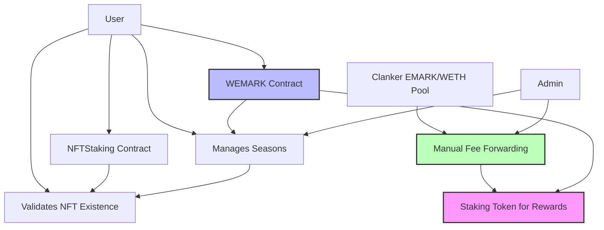

# Evermark-Beta Smart Contracts

This directory contains the complete Evermark smart contract system for on-chain content preservation, creator verification, token staking, voting, and rewards distribution.

## Contract Overview

### FeeCollector.sol (164 lines) - Treasury Smart Contract
**Purpose:** Multi-token treasury that collects Clanker trading fees and forwards to EvermarkRewards

**Core Functions:**
- `collectTradingFees(address token, uint256 amount)` - Receive WETH/EMARK from Clanker pool
- `forwardWethToRewards(uint256 amount)` - Manual WETH forwarding to rewards
- `forwardEmarkToRewards(uint256 amount)` - Manual EMARK forwarding to rewards
- `forwardAllWethToRewards()` - Forward all accumulated WETH
- `forwardAllEmarkToRewards()` - Forward all accumulated EMARK
- `withdrawSpamToken(address token)` - Remove unwanted tokens
- `getTokenBalances()` - View WETH/EMARK balances

**Key Features:**
- **Multi-Token Support:** Handles WETH, EMARK, ETH, and spam tokens
- **Manual Admin Control:** No automatic forwarding, admin-triggered transfers
- **EvermarkRewards Integration:** Direct funding of reward pools
- **Spam Protection:** Recovery mechanism for unwanted tokens
- **Treasury Architecture:** Smart wallet-like functionality

**Integration:** Receives 0.4% of trading fees from Clanker EMARK/WETH liquidity pool → manually forwards to EvermarkRewards

---

### WEMARK.sol (137 lines)
**Purpose:** Non-transferrable ERC20 wrapper for EMARK tokens providing voting power

**Core Functions:**
- `stake(uint256 amount)` - Stake EMARK to receive 1:1 wEMARK
- `startUnbonding(uint256 amount)` - Begin 7-day unbonding process
- `withdraw()` - Complete unstaking after cooldown period
- `cancelUnbonding()` - Cancel unbonding and restore voting power
- `getVotingPower(address user)` - Get user's voting power (wEMARK balance)

**Key Features:**
- 1:1 EMARK ↔ wEMARK staking ratio
- 7-day unbonding cooldown period
- Non-transferrable (voting power cannot be traded)
- SafeERC20 for secure token transfers

**Integration:** Provides voting power to EvermarkVoting, serves as staking token for EvermarkRewards

---

### EvermarkNFT.sol (238 lines)
**Purpose:** Mint and manage Evermark NFTs representing preserved content

**Core Functions:**
- `mintEvermark(string metadataURI, string title, address creator)` - Mint new Evermark
- `mintEvermarkWithReferral(...)` - Mint with referral fee sharing
- `mintEvermarkFor(address to, ...)` - Admin mint to any address (no fee)
- `exists(uint256 tokenId)` - Check if NFT exists
- `setFeeCollector(address)` - Update fee collector address (admin only)

**Key Features:**
- **Minting Fee:** 0.00007 ETH per NFT (~$0.30 at current prices)
- **Content Limits:** Supports up to 25MB media files per evermark
- **Cast Support:** Full Farcaster cast text preserved in metadata
- UUPS upgradeable pattern
- Role-based access control (ADMIN, MINTER, UPGRADER)
- Referral system (10% fee sharing)
- Emergency pause functionality
- NFT minting fees (separate from trading fees)

**Integration:** Validates NFT existence for other contracts, minting fees stay in contract (separate from trading fees)

---

### EvermarkVoting.sol (146 lines)
**Purpose:** Seasonal voting system for Evermark content curation

**Core Functions:**
- `startNewSeason()` - Begin new 7-day voting season (admin only)
- `voteForEvermark(uint256 evermarkId, uint256 votes)` - Cast votes for content
- `getCurrentSeason()` - Get active season number
- `getEvermarkVotesInSeason(uint256 season, uint256 evermarkId)` - Get vote counts
- `getRemainingVotingPower(address user)` - Check available votes for current season

**Key Features:**
- Seasonal voting cycles (7-day duration)
- Direct voting (no delegation system)
- Voting power = wEMARK balance
- Vote tracking per user per season
- Admin-controlled season management

**Integration:** Gets voting power from WEMARK, validates NFT existence via EvermarkNFT

---

### NFTStaking.sol (215 lines) - Simplified for Creator Verification
**Purpose:** Creator verification through Evermark NFT staking

**Core Functions:**
- `stakeNFT(uint256 tokenId)` - Stake Evermark NFT for verification
- `startUnbonding(uint256 tokenId)` - Begin 7-day unbonding process
- `unstakeNFT(uint256 tokenId)` - Complete unstaking after cooldown
- `isVerifiedCreator(address user)` - Check if user has staked NFTs
- `getStakeInfo(uint256 tokenId)` - Get staking status and timing

**Key Features:**
- 7-day unbonding period (matches voting cycles)
- No token rewards (pure verification system)
- UUPS upgradeable pattern
- Emergency admin functions

**Purpose:** Allows content creators to stake their own Evermark NFTs to prove ownership/creation and staked NFTs receive "Verified Asset" status in the app if they have been staked for at least 7 days and not flagged for inauthenticity.

---

### EvermarkRewards.sol (377 lines) - Most Complex
**Purpose:** Dual-token rewards system (EMARK + WETH) with adaptive pool-based distribution

**Core Functions:**
- `claimRewards()` - Claim both EMARK and WETH rewards
- `fundWethRewards(uint256 amount)` - Fund WETH reward pool (admin only)
- `fundEmarkRewards(uint256 amount)` - Fund EMARK reward pool (admin only)
- `getPeriodStatus()` - Get current reward period information
- `getUserRewardInfo(address user)` - Get user's pending rewards

**Key Features:**
- **Dual-Token System:** EMARK (utility) + WETH (value) rewards
- **Adaptive Rates:** Reward rates adjust based on actual pool balances
- **Stable Periods:** Fixed rates for period duration (typically 7 days)
- **Synthetix-Style:** Gas-efficient reward tracking
- **Pool-Based:** Sustainable rewards from funded pools (no infinite emission)
- **Automatic Rebalancing:** Rates update at period end

**Integration:** Uses WEMARK as staking token, rewards wEMARK holders proportionally

---

## System Architecture

### User Flow A: Content Creator Verification
```
Creator → EvermarkNFT.mint() → NFTStaking.stakeNFT() → Verified Creator Badge (off-chain)
```

### User Flow B: Voting Participation  
```
EMARK → WEMARK.stake() → EvermarkVoting.voteForEvermark() → Content Curation
```

### User Flow C: Earning Rewards
```
WEMARK.stake() → EvermarkRewards eligibility → claimRewards() → Receive EMARK + WETH
```

### User Flow D: Trading Fee Collection & Reward Funding
```
EMARK/WETH Trading → Clanker Pool → 0.8% fee split → FeeCollector (0.4%) + Dev Wallet (0.4%)
                                                    ↓
Admin Panel → FeeCollector.forwardToRewards() → EvermarkRewards → wEMARK Staker Rewards
```

## Contract Relationships



## Deployment Architecture

### Contract Types
- **Non-Upgradeable:** FeeCollector, WEMARK, EvermarkVoting
- **UUPS Upgradeable:** EvermarkNFT, NFTStaking, EvermarkRewards

### Deployment Order
1. **FeeCollector** (needs WETH + EMARK addresses)
2. **WEMARK** (needs EMARK token address)
3. **EvermarkNFT** (upgradeable, configure fee collector after)
4. **EvermarkVoting** (needs WEMARK + EvermarkNFT addresses)
5. **NFTStaking** (upgradeable, needs EvermarkNFT address)
6. **EvermarkRewards** (upgradeable, needs EMARK + WEMARK + WETH addresses)

### Configuration Steps
1. **FeeCollector:** Set EvermarkRewards contract address + grant DISTRIBUTOR_ROLE
2. **EvermarkNFT:** Set fee collector address (minting fee is constant 0.00007 ETH)
3. **EvermarkVoting:** Start first voting season
4. **EvermarkRewards:** Fund initial reward pools (optional)

## Technical Implementation

### Security Features
- **All contracts:** Solidity ^0.8.30, MIT licensed
- **Role-based access control:** ADMIN, MINTER, UPGRADER roles
- **Reentrancy guards:** All state-changing functions protected
- **Pausable functionality:** Emergency stops for critical contracts
- **UUPS proxy pattern:** Safe upgrades for complex contracts
- **SafeERC20:** Secure token transfers

### Gas Optimization
- **Efficient storage layouts:** Minimal gas costs for common operations
- **Batch operations:** Where applicable (EvermarkRewards)
- **Event-driven architecture:** Off-chain indexing support
- **Optimized algorithms:** Synthetix-style reward calculations

### Integration Points
- **WEMARK ↔ EvermarkVoting:** Perfect interface compatibility
- **WEMARK ↔ EvermarkRewards:** ERC20 compatibility for staking token
- **Clanker Pool ↔ FeeCollector:** Trading fee collection (0.4% of 0.8% total)
- **FeeCollector ↔ EvermarkRewards:** Manual token forwarding with DISTRIBUTOR_ROLE
- **NFTStaking ↔ EvermarkNFT:** NFT custody and verification

## Key Design Decisions

### 1. **Simplified NFTStaking**
- **Removed:** Complex reward calculations, lock tiers, batch operations
- **Kept:** Simple verification through NFT staking with 7-day unbonding
- **Result:** 75% code reduction, focused on creator verification

### 2. **Separate Fee and Reward Systems**
- **Trading Fee Collection:** Clanker pool trading fees (0.4%) go to treasury via FeeCollector
- **NFT Minting Fees:** Separate 0.00007 ETH fees for NFT minting
- **Reward Distribution:** WETH rewards funded separately in EvermarkRewards
- **Benefit:** Clean separation of concerns, flexible funding

### 3. **Non-Transferrable Voting Power**
- **WEMARK tokens cannot be transferred**
- **Prevents vote buying and maintains governance integrity**
- **Requires actual EMARK staking for voting participation**

### 4. **Adaptive Pool-Based Rewards**
- **No infinite token emission**
- **Sustainable reward distribution based on actual funding**
- **Rates adjust automatically based on pool balances**

### 5. **7-Day Unbonding Across System**
- **WEMARK:** 7-day unbonding for token unstaking
- **NFTStaking:** 7-day unbonding for NFT unstaking
- **EvermarkVoting:** 7-day seasonal cycles
- **Benefit:** Consistent timing prevents gaming across all systems

## Environment Variables Required

```bash
# Existing tokens
VITE_EMARK_TOKEN_ADDRESS=           # EMARK token contract
WETH_ADDRESS=0x4200000000000000000000000000000000000006  # Base WETH

# New contracts
VITE_FEE_COLLECTOR_ADDRESS=         # FeeCollector contract
VITE_WEMARK_ADDRESS=                # WEMARK staking contract  
VITE_EVERMARK_NFT_ADDRESS=          # EvermarkNFT contract
VITE_EVERMARK_VOTING_ADDRESS=       # EvermarkVoting contract
VITE_NFT_STAKING_ADDRESS=           # NFTStaking contract
VITE_EVERMARK_REWARDS_ADDRESS=      # EvermarkRewards contract

# Configuration
FEE_RECIPIENT=                      # Treasury address for fees
```

## Strategic Benefits

### 1. **On-Chain Transparency**
- All voting, staking, and rewards are verifiable on-chain
- No reliance on centralized systems for core functionality

### 2. **Creator Verification**
- Provable content ownership through NFT staking
- "Skin in the game" approach to verification

### 3. **Sustainable Economics**
- Pool-based rewards prevent runaway inflation
- Trading fee collection from Clanker pool provides ongoing platform revenue

### 4. **Governance Integrity**
- Non-transferrable voting power prevents vote buying
- Economic stake required for voting participation

### 5. **Modular Architecture**
- Each contract has focused responsibility
- Upgradeable where needed, immutable where appropriate
- Easy to extend or modify individual components

This architecture provides a solid foundation for the Evermark ecosystem while maintaining simplicity where possible and complexity only where necessary.